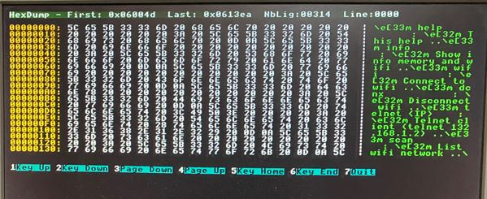

# DUMPVIEW
allows you to display a file as a dump.
This program is a first version, it can be evolved if necessary.

>[!NOTE]
>Limited size file is 204800 Bytes

Copy the dumpview.bin file to the /mos directory

Example commande line: `dumpview <filename>`

The following keyboard keys allow you to navigate to the screen.
```
* Up arrow
* Down arrow
* Page Down
* Page Up
* Home key
* End key
* F10 to exit
```



