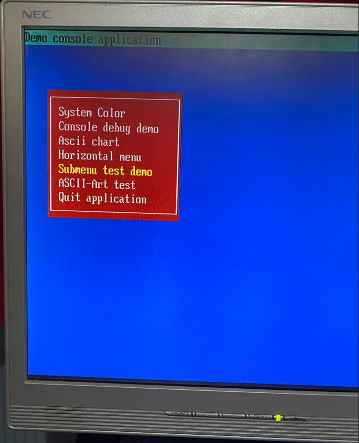
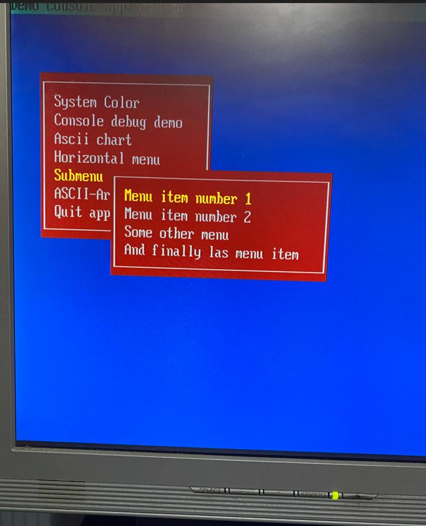
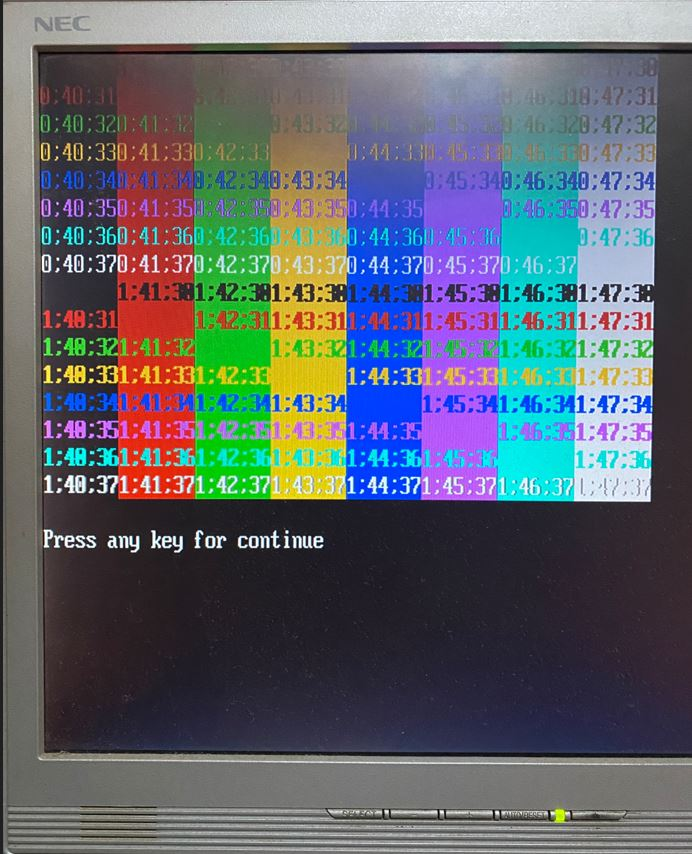
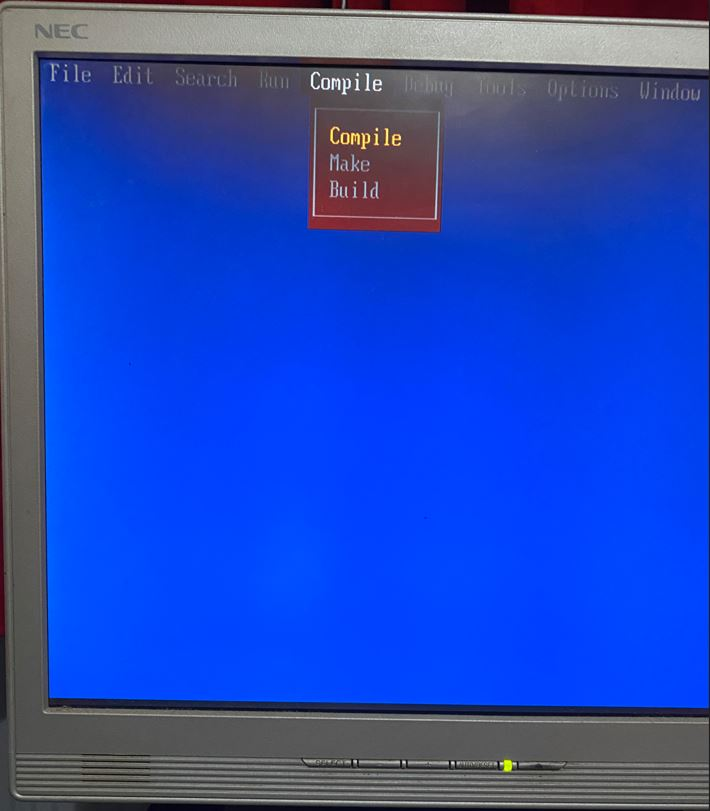
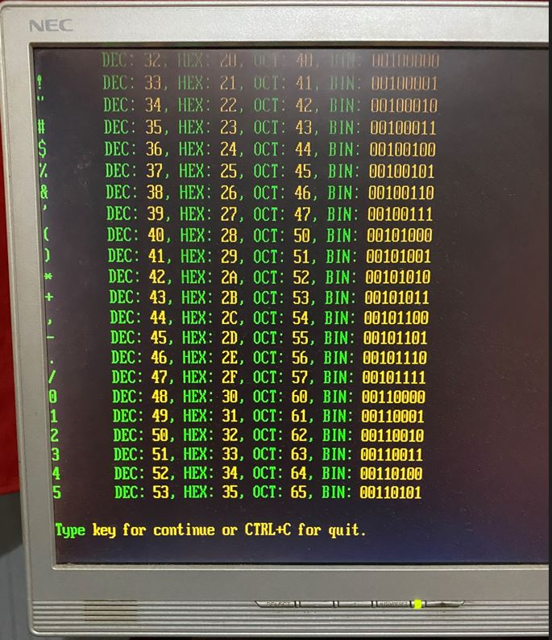

### Demo menu VGA

Demo menu VGA on agon in console mode (VDU 23,0,0xFF). It use escape code ansi terminal.  
Keyboard on console mode not work because  none of the MOS keyboard routines will work on this mode.  
I use MOD-RS232 adapter from olimex connected to computer for navigate with keyboard.  
Open a terminal (ex: teraterm for windows), select com port and open it, now you can navigate with keyboard.

Put a file on /mos directory.

Command line: `menuvga`


>[!IMPORTANT]
>When you quit application, console mode not return on mos, you have to reset agon with button reset


**Navigation**

```
Up arrow or CTRL-E
Down arrow or CTRL-X
Home key or CTRL-A
End key or CTRL-F
CTRL-D for Right
CTRL-S for Left
Enter
```

**Action of keys**

```
Enter key validate option.
Esc key for quit application or submenu
For quit horizontal menu, select help option and type enter key or Esc key.
```


**Screenshots (Not updated)**








